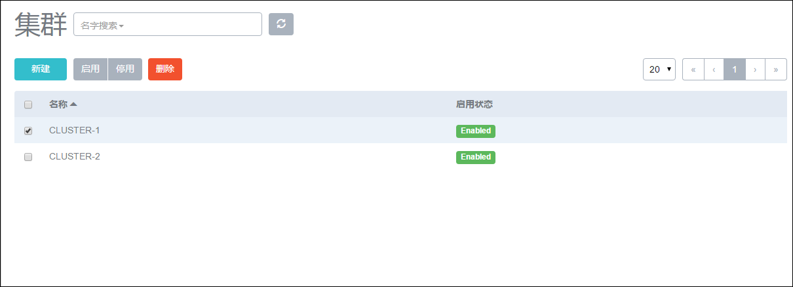

# 9.1 集群介绍

在第一章概述中，我们已经介绍了各种术语的概念，由于集群是一个新引入的概念，有必要先介绍一下几种主要资源之间的依赖关系。

###### 图9-1-1  镜像详细信息界面

如图9-1-1所示，作为 一个区域是由类似主存储，集群，L2网络的资源组成的逻辑组; 它定义一个可见的边界，在相同区域中的资
源互相可见并且可以形成某种关系，但在不同区域中的资源是不行的. 例如, 区域A中的一个主存储可以挂载
到区域A中的一个集群，但不能挂载到区域B的集群上.

- 一个集群可以挂载一个或者多个主存储, 一个主存储也可以加载多个集群。只要这些主存储可以被这个集群中的所有主机访问. 同时, 主存储也
可以从集群卸载。主存储与集群的依赖关系如图9-1-3所示

- 只要集群中的主机都在所挂载的L2网络所代表的物理二层广播域中,一个集群可以挂载一个或多个L2网络。一个网卡只能创建一个L2网络，同一类型的多块网卡可以用统一的网卡名创建多个L2网络，但只能挂载到不同的集群。

 一个Zone可以加载多个镜像服务器，所以一个镜像服务器可以为多个集群提供服务。但可用镜像服务器的类型与集群所加载的主存储类型有关。

> 例如，当用户的某个云主机已经运行在NFS类型的主存储上时，那么他的镜像服务器只能使用镜像仓库或者SFTP类型。

主存储与镜像服务器的对应关系如图9-1-4所示