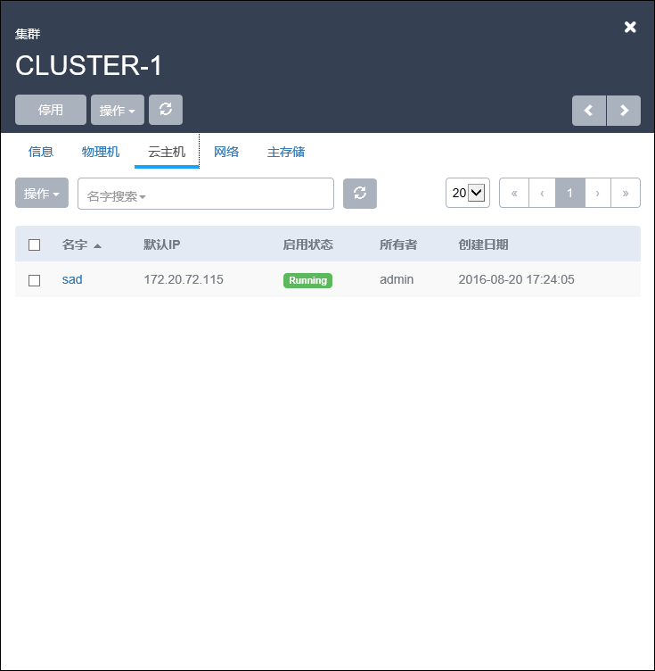

# 9.2 单集群操作

在集群列表界面，点击相应集群的名字，可以展开集群的详细信息并对集群进行相应的操作，如图9-1-1所示。

###### 图9-2-1  镜像详情信息界面

可支持启用、停用、删除、修改名字、简介等操作。点击右上角关闭按钮可以关闭窗口。

单个集群的具体操作定义如下：

1.修改名字、简介等操作：

支持对集群的名字、简介进行修改。

2.操作物理机：
在集群的详情页面可以显示该集群中物理机的IP、虚拟化技术、状态等信息。如图9-2-2所示。

###### 图9-2-2  镜像详细信息界面

3.操作云主机：
在集群的详情页面可以显示该集群中所有物理机上的云主机信息。如图9-1-3所示。

###### 图9-1-1 镜像详细信息界面

4.操作网络：

在集群的详情页面可以显示该集群上所加载的网络信息。如图9-1-4所示

###### 图9-1-1 镜像详细信息界面

5.操作主存储
在集群的详情页面可以显示该集群上所加载的主存储信息。如图9-1-4所示。

###### 图9-1-1 镜像详细信息界面。