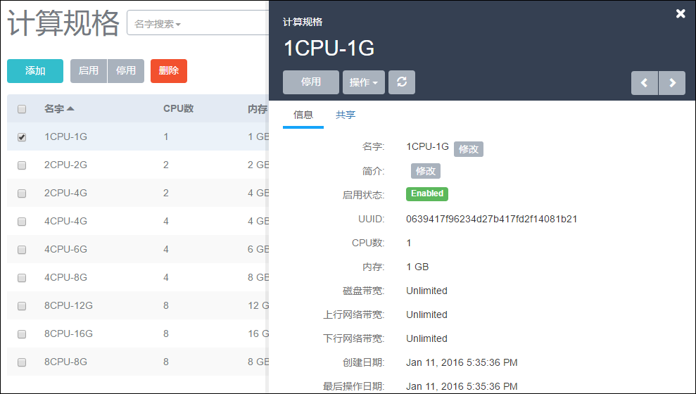

# 15 计算规格管理

点击菜单栏的计算规格，进入计算规格管理界面，如图15-1示。在计算规格管理界面，可以添加、删除计算规格，也可以进行批量操作。

###### 图15-1  计算规格管理界面

点击某个计算规格，可以查看这个计算规格的详情，除了停用和删除操作，只可以修改这个计算规格的名字和简介，如图15-2所示。

###### 图15-2  计算规格详情界面

在用户管理中，支持对计算规格的共享与召回，具体请参考[18.3](/User-MN/sharing-cancel.md)资源共享与召回。

在计算规格列表界面，点击添加，可以添加一个计算规格，如图15-3所示。在添加界面，需要输入如下信息：

1. 名字：计算规格的名字。

2. 简介：可留空不填。

3. CPU数：云主机CPU的核数。

4. 内存：云主机内存的大小。

5. 磁盘带宽：云主机根云盘和数据云盘的IO带宽上限。为空时，代表不限制IO带宽。带宽设置的基本单位为MB/s。

6. 上行网络带宽：从云主机上上传的网络带宽的上限。为空时，代表不限制上行网络带宽。

7. 下行网络带宽：从云主机上下载的网络带宽的上限。为空时，代表不限制下载网络带宽。

注意：用户需完全理解磁盘带宽和网络带宽配置的含义后，才能进行对应的设置，否则可能会导致无法从云主机下载文件。

###### 图15-3  添加计算规格界面
