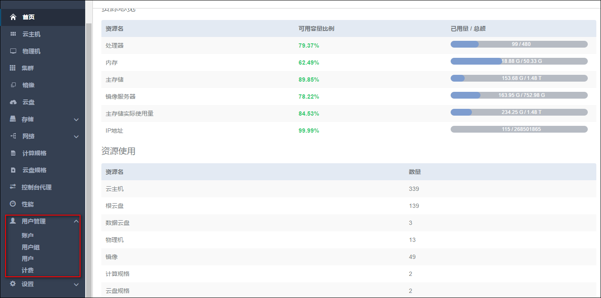
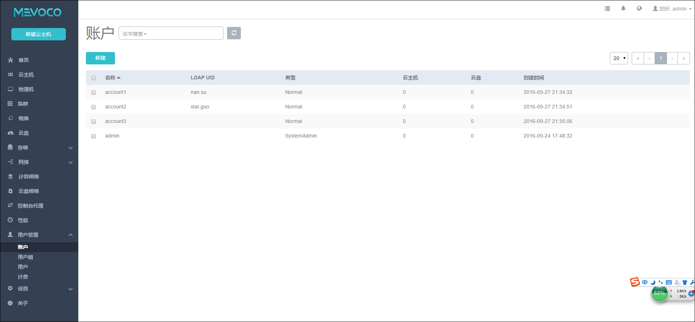
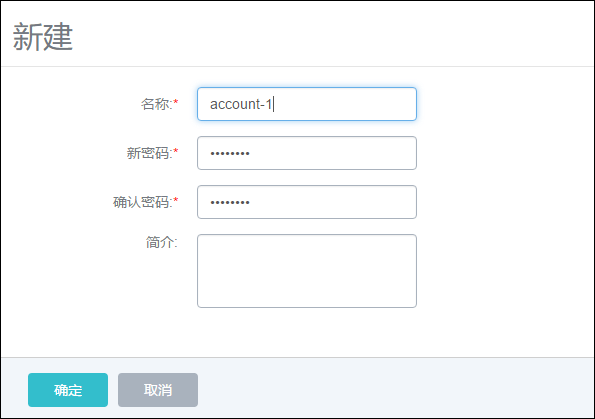
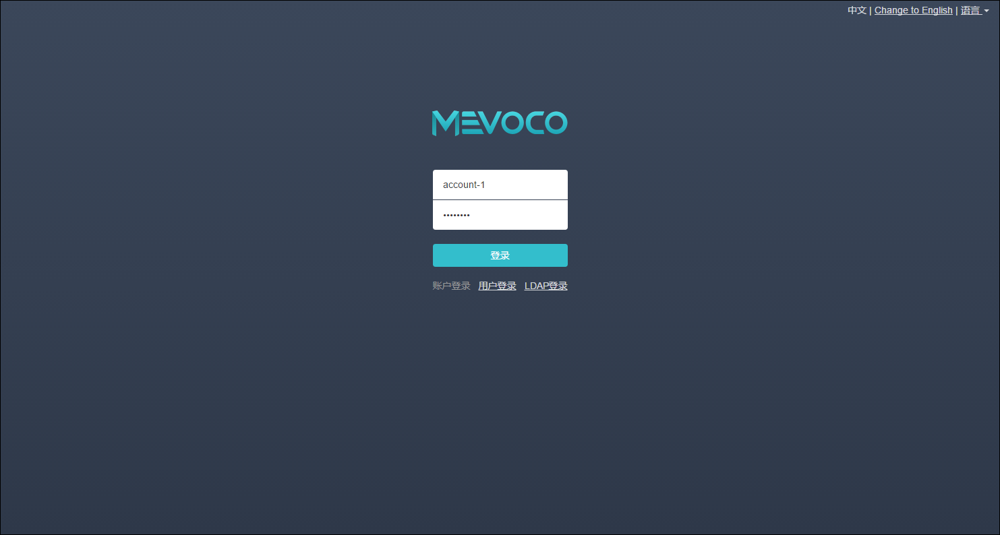
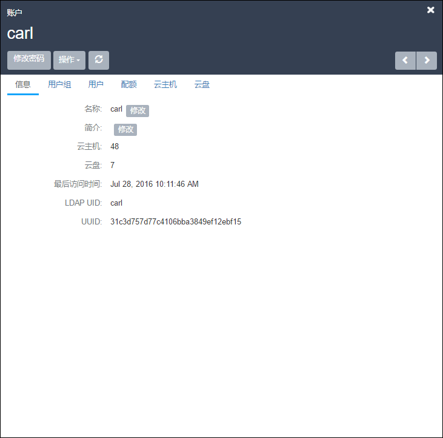
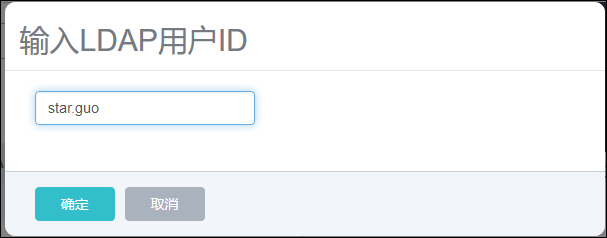

# 19.1 账户

点击主界面左侧菜单栏的用户管理按钮可以展开用户管理相关的菜单按钮。如图19-1-1所示。

###### 图19-1-1  用户管理界面

点击账户按钮，系统UI会显示账户的相关页面，如图19-1-2所示。

###### 图19-1-2  账户界面

账户管理支持的操作如下：

1.新建账户：点击新建按钮，系统会弹出新建账户的界面，如图19-1-3所示。输入账户名称和密码，并再次输入密码进行确认。简介内容可以留空不填。账户名称不能超过120个字符，可支持中文。建议密码不少于6位，两次输入需一致。

###### 图19-1-3  新建账户界面

2.登录账户：创建成功后，退出后，即可使用此账户进行登录。如图19-1-4所示。

###### 图19-1-4 账户登录界面

3.账户详情：在账户管理页面，单击账户名称可显示账户详情， 如图19-1-5所示。账户页面显示了账户信息、账户下属的用户组和用户、配额、云主机和云盘信息。账户界面还可显示当前账户的计费信息。计费相关的功能请参考17.4计费设置和17.5账户计费章节。

###### 图19-1-5 账户详情

4.修改账户名：通过admin账户点击账户信息页的名称后的修改按钮进行修改。修改需退出登录后生效。

5.修改密码：账户的密码可以通过账户自己登录系统后点击右上角的修改密码进行修改，也可以通过admin账户点击账户信息页的修改密码按钮进行修改。修改需退出登录后生效。

6.修改简介：账户的相关简介可由admin账户在账户详情页进行修改。

7.修改配额：修改账户的配额设置，如图19-1-6所示，默认情况下云主机数量最多20个，CPU数量为80个，内存最大容量为80G，数据云盘最大数量为40个。所有云盘最大容量为10TB。可点击相应的项目在新弹出的界面进行修改。

###### 图19-1-6 账户配额

8.删除账户：点击删除按钮，会删除此账户下的所有资源，需要输入删除账户进行确认。如图19-1-7所示。

###### 图19-1-7 删除账户确认

9.共享资源：普通账户默认看不到计算规格、云盘规格、网络及admin或者其他账户创建的资源，admin账户可以在相关的资源页面点击共享按钮进行分享。如图19-1-8所示的为网络共享的按钮。通过点击共享即可分享给普通账户使用。

###### 图19-1-8 共享网络资源

10.查看用户和用户组信息: admin账户可以查看用户和用户组信息，可修改用户的密码，除此外不可对用户进行权限控制或对用户组的用户进行添加删除操作。

11.账户首页看到的资源上限是admin账户分配的资源配额的上限。

12.账户创建云主机前，需要admin账户提前共享计算规格、网络和云盘规格等资源，否则不可创建云主机。普通账户可以添加自有的镜像文件，也可由admin账户提前共享。

