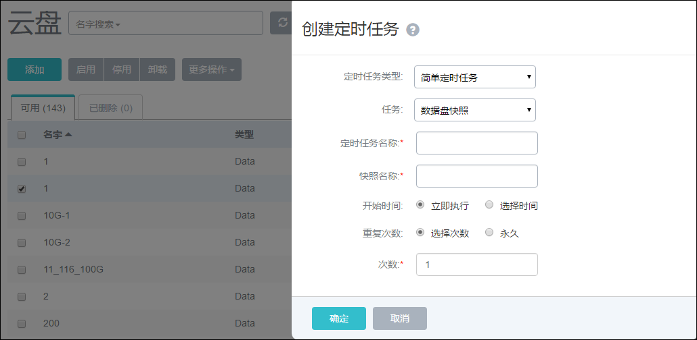

# 18.2 用户及用户组

在普通账户登录系统后，可以创建用户和用户组。普通账户可见的菜单栏包括首页、云主机、镜像、云盘、用户管理、安全组和关于页面。其他admin账户的菜单栏不可见。

用户管理支持的操作如下：

1.创建用户组：点击左侧的用户组按钮，在新界面点击新建，会弹出新建界面，如图18-2-1所示，输入相应的用户组名和简介。点击确定即可创建用户组。

###### 图18-2-1 创建用户组

2.创建用户：点击左侧的用户按钮，在新界面点击新建，会弹出新建界面，如图18-2-2所示，输入相应的用户名、密码和确认密码、简介。点击确定即可创建用户。

###### 图18-2-2 创建用户

3.添加用户到用户组：在用户组详情页面，点击添加用户按钮，如图18-2-3所示，会弹出新的界面进行筛选本账户下所有未添加入此用户组的用户列表。勾选相应的用户，点击确定即可添加用户到此用户组，如图18-2-4所示。

###### 图18-2-3 用户组详情页

###### 图18-2-4 添加用户到用户组

4.从用户组移除用户：在用户组详情页面，点击用户按钮，会显示用户组内用户信息，勾选相应的用户，可以多选，点击移除用户即可将用户从用户组移除，如图18-2-5所示。如果点击了用户组详情页的删除按钮，会删除选中的用户。

###### 图18-2-5 从用户组移除用户

5.权限控制：用户组权限和用户权限有相同的权限控制条目，总体分为四类：云主机、云盘、安全组和用户。此四类权限可通过总控的打开和关闭按钮进行统一控制。点击相应的打开和关闭按钮，会对此四大类权限进行批量控制。此四大类的权限还细分为更详细的权限控制条目，如图18-2-6所示。可以通过点击相应条目后面的on/off按钮进行开关的控制。显示为蓝色的表示为on，显示为灰色的表示为off。因为相应的权限条目之间存在相关的逻辑关系，在打开某个条目，可能导致其他权限条目也会打开，来保证相关业务流程正常运行。

> 例如，打开冷迁移云主机权限，会需要卸载云盘，迁移云盘，加载云盘。所以打开冷迁移云主机权限，这几个权限也会打开。其中对用户组的权限控制会对组内用户生效。对用户的权限控制只对本用户生效。如果用户组和用户的权限列表状态出现不一致的情况，那么两者的权限为逻辑或的关系，例如其中某条目的权限在用户显示off，但是在用户组显示on，则此条目的权限为打开状态。

注意：如果用户所在的任一用户组，打开了某权限，而尝试在用户界面进行关闭此权限会提示“不能关闭，所属用户组已打开权限”。需要将用户所在的所有打开此权限的用户组关闭掉，才可在用户界面关闭此权限。

###### 图18-2-6 权限控制

6.修改用户组名：在用户组详情页的信息栏中，点击名称后面的修改按钮，可以修改用户组名。

7.修改用户组简介：在用户组详情页的信息栏中，点击简介后面的修改按钮，可以修改用户组简介。

8.修改用户名：在用户详情页的信息栏中，点击名称后面的修改按钮，可以修改用户名。

9.修改用户简介：在用户详情页的信息栏中，点击简介后面的修改按钮，可以修改用户简介。

10.修改用户密码：在用户详情页的信息栏中，点击修改密码按钮，可以修改用户密码。

11.删除用户组：可点击用户组的详情页的删除按钮或在用户组界面的列表选中待删除的用户组，进行删除确认。

12.删除用户：可点击用户的详情页的删除按钮或在用户界面的列表选中待删除的用户，进行删除确认。

用户登录：在用户登录前，需点击登录界面的使用用户名登录按钮，再输入账户名、用户名和用户密码。如图18-2-7所示。用户名登录后，看不到用户管理相关的界面。只能在账户的控制下，对账户的资源进行操作。用户可见的菜单包括首页、云主机、镜像、云盘、安全组和关于页面。

###### 图18-2-7 用户登录界面

